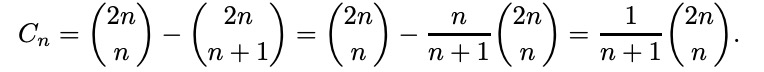
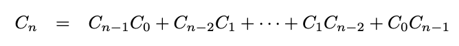

Computer project for discrete math about Catalan Numbers.
1) Compute diagonal-avoiding paths (Lida)
2) Compute ways of polygon triangulation (Lida)
3) Compute ways to put balanced parentheses (Maria)
4) Recursive formula and preconditions for catalan numbers (Anton)
5) Derive a formula for n-th Catalan number (using power series) (Ostap)

Висновки:
1. Знайдіть методом комп'ютерної симуляції кількість монотонних цілочисельних шляхів з точки (0, 0) до точки (n, n).
   Знайти кількість монотонних цілочисельних шляхів можна за допомогою цієї формули:
   

   Для n = 6, тобто шосте число Каталана дорівнює 132
   Використовуючи функцію ways_to_dot, розроблену Лідією Семсічко, результат теж 132
3. Знайдіть методом комп'ютерної симуляції кількість способів провести n діагоналей (які попарно не перетинаються) у правильному 2n-кутнику.
   Знайти кількість способів можна за допомогою цієї формули:
   

   ,однак для многокутника треба брати n - 2
   Для n = 6, тобто четверте число Каталана дорівнює 5
   Використовуючи функцію diagonal_counting, розроблену Лідією Семсічко, резльтат теж 5
5. Знайдіть методом комп'ютерної симуляції кількість правильних дужкових послідовностей довжини 2n.
   Знвйти кількість послідовностей можна за допомогою цієї формули:
   

   Для n = 4, тобто четверте число Каталана дорівнює 5
   Використовуючи функцію parentheses, розроблену Марією Онищук, результат теж 5
7. Знайдіть початкові умови для чисел Каталана та напишіть програму, яка ефективно знаходить перші n чисел Каталана, використовуючи рекурентну формулу.
   Рекурентна формула для n числа Каталана виглядає так:
   Cn = sum(n - 1, i = 0, Ci * Cn-1-i)

   За формулою, для n = 6, число Каталана дорівнює 132
   Використовуючи функцію catalan_recursive, розроблену Антоном Валігурським, результат теж 132
9. Спробуйте аналітично вивести формулу (коротку) для n-того числа Каталана з рекурентної формули (використайте степеневі ряди). Напишіть програму яка розраховує перші n чисел Каталана згідно з цією формулою.
   Отримання генеруючої функції полягає в розгляді багатокутників (конвексних n-кутників) з n+2 вершинами, де кожна пара вершин з'єднана відрізком і не перетинається з іншими відрізками, крім кінців. Кількість таких багатокутників також є n-тим числом Каталана. Це призводить до такої генеруючої функції:

   C(x) = (1 - sqrt(1-4x))/2x
   За формулою, для n = 6, cума чисел Каталана дорівнює 345895
   Використовуючи функцію catalan_powers, розроблену Остапом Павлишиним, результат теж 345895
