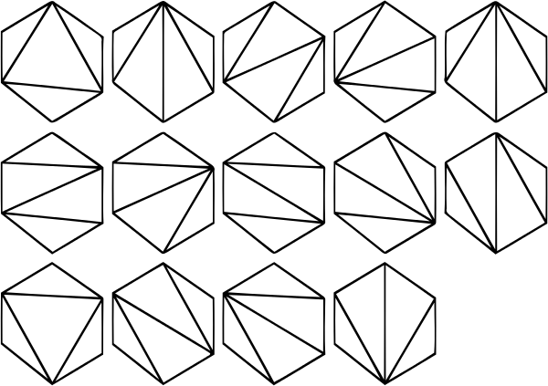
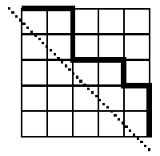
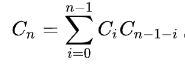
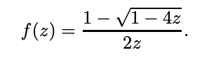

Computer project for discrete math about Catalan Numbers.
1) Compute diagonal-avoiding paths (Lida)
2) Compute ways of polygon triangulation (Lida)
3) Compute ways to put balanced parentheses (Maria)
4) Recursive formula and preconditions for catalan numbers (Anton)
5) Derive a formula for n-th Catalan number (using power series) (Ostap)

Висновки:

Числа Каталана - числова послідовність, названа на честь бельгійського математика Каталана. 

Деякі з чисел Каталана: 1, 1, 2, 5, 14, 42, 132, 429, 1430, 4862, 16796, 58786, ...

n-те число Каталана можна визначити багатьма способами, ось деякі:

- Кількість розбиттів опуклого (n+2)-кутника на трикутники діагоналями, що не перетинаються.

   

- Кількість правильних дужкових структур довжини 2n.

   Наприклад, для n=3 існує 5 таких послідовностей:
  
   ((())), ()(()), ()()(), (())(), (()())
   
- Кількість монотонних цілочисельних шляхів з точки (0, 0) до точки (n, n):

   Приклад шляху:

   

Властивості чисел Каталана:

- Рекурентні співвідношення:
  
   

- Генеруюча функція:

   

- Біноміальні коефіцієнти

   

1. Знайдіть методом комп'ютерної симуляції кількість монотонних цілочисельних шляхів з точки (0, 0) до точки (n, n).
   Кількість монотонних цілочисельних шляхів можна знайти за допомогою формули біноміальних коефіцієнтів.
   
   Для n = 4 число Каталана дорівнює 14.
   
   Для симуляції використовується функція ways_to_dot, розроблена Лідією Семсічко.
   Крок може бути лише вправо або вниз. Кількість шляхів до будь-якої точки у матриці можна розрахувати якщо використати кількість шляхів до двох попередніх точок - верхньої і лівої. Далі створюється пуста матриця n x n. Перший рядок і перший стовпчик - 1, бо інсує лише 1 спосіб дістатися до них - вниз або вправо. Рахуємо для кожної точки, це буде сума двох точок, верхньої і лівої. Повертаємо кількість у нижній правій точці і ділимо на n-1. Для n = 4, варіантів 14.

   Результат співпадає. 
   
3. Знайдіть методом комп'ютерної симуляції кількість способів провести n діагоналей (які попарно не перетинаються) у правильному 2n-кутнику.
   Кількість таких способів можна знайти за допомогою першої формули біноміальних коефіцієнтів.

   Для n = 4 число Каталана дорівнює 14.
   
   Для симуляції використовується функція diagonal_counting, розроблена Лідією Семсічко.
   Функція розбиває одну тріангуляцію, та множимо її на всі можливі тріангуляції в іншій частині, і так для всіх можливих варіантів.
   Для n = 4, варіантів 14.

   Результат співпадає.
   
5. Знайдіть методом комп'ютерної симуляції кількість правильних дужкових послідовностей довжини 2n.
   Кількість таких способів можна знайти за допомогою формули рекурентності.

   Для n = 4 число Каталана дорівнює 14.

   Для симуляції використовується функція parentheses, розроблена Марією Онищук.
   Функція працює рекурсивно. Внутрішня функція dfs перевіряє, чи кількість дужок рівно удвічі більша за число n. Якщо ні - ми перевіряємо, чи достатньо відкритих дужок. Якщо дужок недостатньо - рекурсивно викликаємо внутрішню фінкцію(аргументи які ми передаємо це кількість відкритих дужок + 1, кількість закритих та стрічку, куди ми записуємо комбінацію дужок). Далі перевіряємо чи кількість закритих дужок рівна кількості відкритих. Якщо ні - знову рекурсивно викликаємо вбудовану функцію (аргументи - дужок, кількість закритих + 1 та стрічку). Саме рекурсія дозволяє перебрати всі варіанти. Для n = 4, варіантів 14.

   Результат співпадає.
   
6. Знайдіть початкові умови для чисел Каталана та напишіть програму, яка ефективно знаходить перші n чисел Каталана, використовуючи рекурентну формулу.
   Початкові умови для чисел Каталана це рекурентна формула.

   Функція catalan_recursive, розроблена Антоном Валігурським, використовує цю формулу при обчисленні.
   
7. Спробуйте аналітично вивести формулу (коротку) для n-того числа Каталана з рекурентної формули (використайте степеневі ряди). Напишіть програму яка розраховує перші n чисел Каталана згідно з цією формулою.
   
   Отримання генеруючої функції полягає в розгляді багатокутників (конвексних n-кутників) з n+2 вершинами, де кожна пара вершин з'єднана відрізком і не перетинається з іншими відрізками, крім кінців. Кількість таких багатокутників також є n-тим числом Каталана. Це призводить до генеруючої функції, вказаної вище.

   Функція catalan_powers, розроблена Остапом Павлишиним, використовує формулу генеруючої функцію для пошуку суми перших n чисел Каталана.
